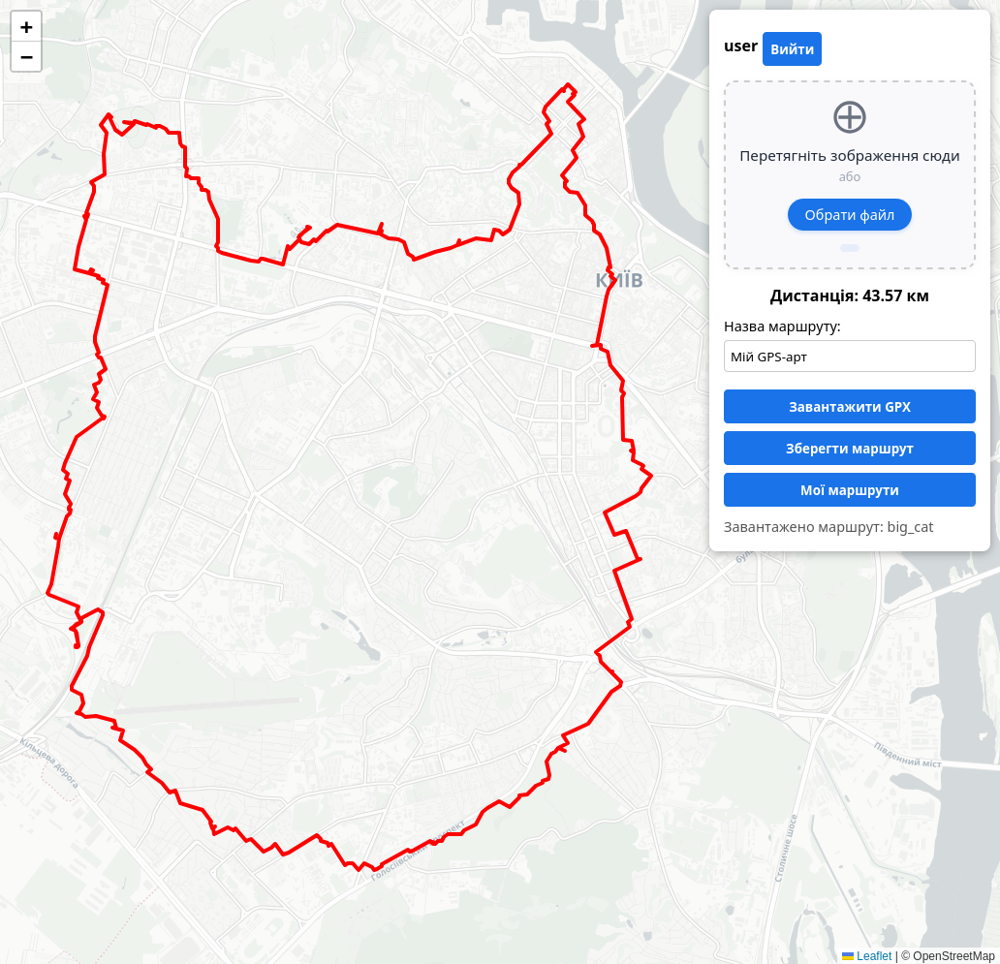

# RunMap – Генератор GPS-арту з зображень

**RunMap** — це веб-застосунок для перетворення намальованого контуру зображення на реальний маршрут для бігу або прогулянки, який можна експортувати у GPX.  
Проект використовує афінну трансформацію для точного припасування малюнка до карти та **OSRM** для прокладання шляху дорогами.

 

## Можливості

- **Завантаження зображення** — підтримка drag & drop або вибору файлу.
- **Резинова трансформація** — змінюйте положення, масштаб та поворот малюнка прямо на карті.
- **Автоматична маршрутизація** — контур проєктується на дорожню мережу через OSRM (піший або велосипедний профіль).
- **Збереження маршрутів** — авторизовані користувачі можуть зберігати створені маршрути у базі даних.
- **Експорт GPX** — завантажте готовий трек для використання у навігаторах або спортивних годинниках.
- **Перегляд історії** — список усіх збережених маршрутів із можливістю завантажити їх на карту.

## Технології

### Backend
- **Django 6.0** + **Django REST Framework**
- **PostgreSQL** + **PostGIS** (геопросторові дані)
- **Simple JWT** (автентифікація)
- **OpenCV** (обробка зображень)
- **OSRM** (маршрутизація)

### Frontend
- **Leaflet** (інтерактивна карта)
- **Vite** (збірка)

## Передумови

- **Python 3.12+**
- **Node.js 18+** та **npm**
- **PostgreSQL 14+** із розширенням **PostGIS**
- **OSRM** (локальний сервер або Docker-контейнер)

## Встановлення та запуск

### 1. Клонування репозиторію

```bash
git clone https://github.com/casaviadisto/parallel-computing/tree/LR4-ful
cd runmap
```

### 2. Налаштування бази даних (PostgreSQL + PostGIS)

Створіть базу даних та активуйте розширення PostGIS:

```bash
CREATE DATABASE runmap;
CREATE USER runmap_user WITH PASSWORD 'runmap_user';
ALTER ROLE runmap_user SET client_encoding TO 'utf8';
ALTER ROLE runmap_user SET default_transaction_isolation TO 'read committed';
ALTER ROLE runmap_user SET timezone TO 'UTC';
GRANT ALL PRIVILEGES ON DATABASE runmap TO runmap_user;
```

Підключіться до бази `runmap` та виконайте:

```sql
CREATE EXTENSION postgis;
```

> Параметри підключення (ім'я БД, користувач, пароль) можна змінити у файлі `backend/config/settings.py`.

### 3. Встановлення та запуск OSRM

Найпростіший спосіб — використати Docker. Завантажте мапу (наприклад, України) з [Geofabrik](https://download.geofabrik.de/europe/ukraine.html) та виконайте:

```bash
# Завантаження PBF-файлу
wget https://download.geofabrik.de/europe/ukraine-latest.osm.pbf

# Екстракція та запуск OSRM (профіль foot)
docker run -t -v $(pwd):/data osrm/osrm-backend osrm-extract -p /opt/foot.lua /data/ukraine-latest.osm.pbf
docker run -t -v $(pwd):/data osrm/osrm-backend osrm-partition /data/ukraine-latest.osrm
docker run -t -v $(pwd):/data osrm/osrm-backend osrm-customize /data/ukraine-latest.osrm
docker run -d -p 5000:5000 -v $(pwd):/data osrm/osrm-backend osrm-routed --algorithm mld /data/ukraine-latest.osrm
```

Після цього OSRM буде доступний за адресою `http://127.0.0.1:5000`.  
Переконайтеся, що змінна `OSRM_BASE_URL` у `settings.py` вказує на цю адресу.

### 4. Запуск Backend (Django)

Перейдіть до директорії бекенду:

```bash
cd backend
```

Створіть та активуйте віртуальне середовище:

```bash
python3 -m venv venv
source venv/bin/activate   # Для Windows: .\venv\Scripts\activate
```

Встановіть залежності:

```bash
pip install -r requirements.txt
```

Виконайте міграції:

```bash
python manage.py migrate
```

Запустіть сервер розробки:

```bash
python manage.py runserver
```

Бекенд буде доступний на `http://127.0.0.1:8000`.

### 5. Запуск Frontend (Vite)

Відкрийте новий термінал, перейдіть до директорії фронтенду:

```bash
cd frontend
```

Встановіть залежності:

```bash
npm install
```

Запустіть сервер розробки:

```bash
npm run dev
```

Фронтенд зазвичай запускається на `http://localhost:5173`. Відкрийте цю адресу у браузері.

## Використання

1. **Увійдіть** або **зареєструйтесь** через модальне вікно.
2. **Завантажте зображення** (перетягніть або оберіть через кнопку).  
   Підтримуються формати `.jpg`, `.png`. Контур має бути чітким, бажано монохромним.
3. **Відредагуйте положення** малюнка на карті:
   - Перетягуйте прямокутник для переміщення.
   - Тягніть за кути — зміна розміру.
   - Тягніть за маркер `↻` — поворот.
4. Після кожної зміни автоматично виконується запит до сервера, і на карті з'являється червоний маршрут, прив'язаний до доріг.
5. **Збережіть маршрут**, вказавши його назву.
6. **Експортуйте GPX** для використання в інших програмах.
7. Переглядайте **список збережених маршрутів**, завантажуйте їх на карту або знову експортуйте.

## 📁 Структура проекту

```
runmap/
├── backend/               # Django-проект
│   ├── config/            # Налаштування проекту
│   ├── runmap/            # Основний додаток
│   ├── media/             # Завантажені зображення маршрутів
│   ├── manage.py
│   └── requirements.txt
├── frontend/              # Vite + Leaflet
│   ├── src/
│   │   ├── main.js
│   │   ├── style.css
│   │   └── ...
│   ├── index.html
│   └── package.json
└── README.md
```


##  Подяки

- [OpenStreetMap](https://www.openstreetmap.org) та [OSRM](http://project-osrm.org) за картографічні дані та маршрутизацію.
- [Leaflet](https://leafletjs.com) за чудову бібліотеку карт.
